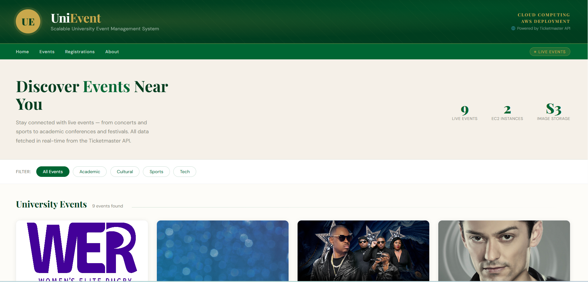
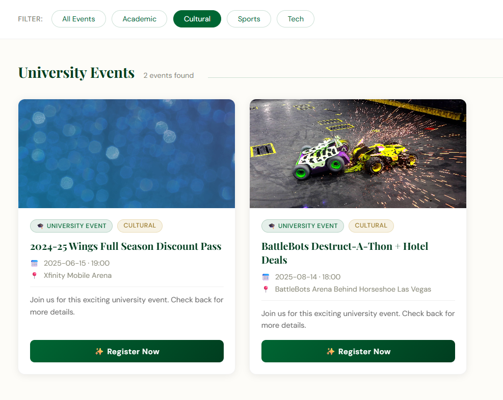
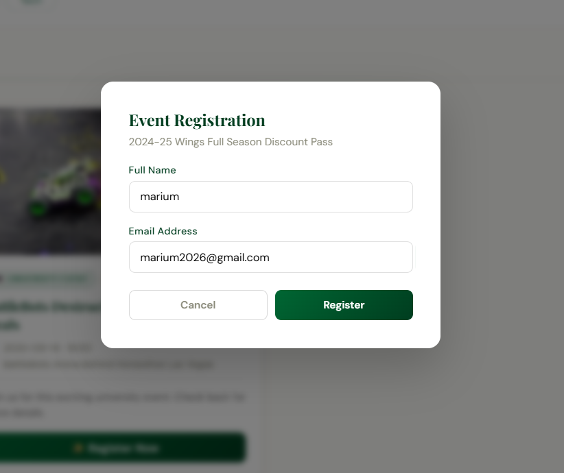
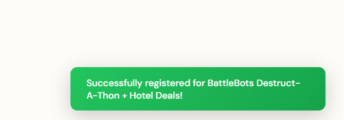
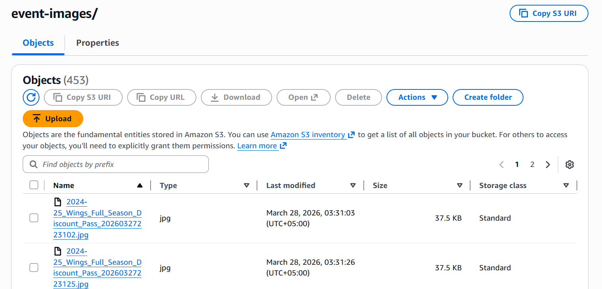

# 🎓 UniEvent — Scalable University Event Management System on AWS

A cloud-native, scalable event management platform built with **Flask** and deployed on **AWS**. UniEvent fetches real-time event data from the **Ticketmaster Discovery API** and displays them as university events. The system supports event registration, image storage on S3, and is deployed across multiple EC2 instances behind an Application Load Balancer for fault tolerance.

---

## 🌐 Live Demo

Access the deployed application via AWS Load Balancer:

```
http://<your-alb-dns-here>
```

> Replace with your actual ALB DNS name from the AWS Console → EC2 → Load Balancers.

---

## 📋 Table of Contents

- [Features](#-features)
- [Architecture](#-architecture)
- [Tech Stack](#-tech-stack)
- [API Justification](#-api-justification)
- [Project Structure](#-project-structure)
- [Setup Instructions](#-setup-instructions)
  - [Local Development](#local-development)
  - [EC2 Deployment](#ec2-deployment)
- [How It Works](#-how-it-works)
- [Data Flow Summary](#-data-flow-summary)
- [Screenshots](#-screenshots)
- [Environment Variables](#-environment-variables)
- [API Endpoints](#-api-endpoints)
- [Fault Tolerance Test](#-fault-tolerance-test)
- [Security Design](#-security-design)
- [Scalability](#-scalability)
- [Future Improvements](#-future-improvements)
- [Author](#-author)

---

## ✨ Features

| Feature | Description |
|---------|-------------|
| **API-Based Event Fetching** | All events are fetched in real-time from the Ticketmaster Discovery API — no hardcoded or static data |
| **Event Registration** | Users can register for events via a modal form; registrations stored in a JSON file |
| **S3 Image Storage** | Event images are downloaded and uploaded to an S3 bucket, replacing external URLs with S3-hosted URLs |
| **Load Balanced Architecture** | Application deployed across 2 EC2 instances behind an AWS Application Load Balancer |
| **Fault Tolerance** | Multi-AZ deployment with health checks ensures high availability |
| **Responsive Design** | Beautiful, mobile-friendly UI with smooth animations and filtering |
| **Health Check Endpoint** | `/health` endpoint for ALB target group health monitoring |
| **Secure Credential Management** | API keys loaded via environment variables; IAM roles used for S3 access |

---

## 🏗 Architecture

```
                    ┌─────────────────┐
                    │    Internet      │
                    └────────┬────────┘
                             │
                    ┌────────▼────────┐
                    │  Application    │
                    │  Load Balancer  │
                    │  (Public Subnet)│
                    └───┬─────────┬───┘
                        │         │
              ┌─────────▼──┐  ┌──▼─────────┐
              │  EC2 - AZ1  │  │  EC2 - AZ2  │
              │ (Private    │  │ (Private    │
              │  Subnet)    │  │  Subnet)    │
              │             │  │             │
              │ Flask App   │  │ Flask App   │
              │ Port 80     │  │ Port 80     │
              └──────┬──────┘  └──────┬──────┘
                     │                │
                     └───────┬────────┘
                             │
                    ┌────────▼────────┐
                    │   Amazon S3     │
                    │ (Event Images)  │
                    └─────────────────┘
```

### AWS Components

| Component | Purpose |
|-----------|---------|
| **VPC** | Isolated virtual network with public and private subnets |
| **EC2 (×2)** | Flask application servers running in private subnets |
| **ALB** | Distributes traffic across EC2 instances; terminates HTTP |
| **Target Group** | Health-checked group of EC2 instances |
| **S3 Bucket** | Stores event images uploaded from Ticketmaster |
| **IAM Role** | Grants EC2 instances permission to access S3 (no hardcoded credentials) |
| **NAT Gateway** | Allows private instances to access the internet (API calls) |

---

## 🛠 Tech Stack

| Layer | Technology |
|-------|------------|
| **Backend** | Python 3, Flask |
| **Frontend** | HTML5, CSS3, JavaScript (Jinja2 templating) |
| **External API** | Ticketmaster Discovery API v2 |
| **Cloud Provider** | AWS (EC2, S3, ELB, VPC, IAM) |
| **Image Storage** | Amazon S3 via boto3 |
| **Dependencies** | requests, python-dotenv, boto3 |

---

## 🔗 API Justification

### Why Ticketmaster Discovery API?

| Criteria | Justification |
|----------|---------------|
| **Free Tier** | Offers a generous free API key (5,000 requests/day) |
| **Rich Data** | Provides event name, date, time, venue, images, descriptions |
| **RESTful JSON** | Clean, well-documented JSON responses |
| **Reliability** | Industry-standard API with high uptime |
| **Relevance** | Real-world events suitable for a university event management demo |

### What Data It Provides

- **Event Name** — title of the event
- **Date & Time** — start date and local time
- **Venue** — venue name and location
- **Description** — event info or notes
- **Images** — high-resolution event images
- **Categories** — used for filtering (mapped to academic/cultural/sports/tech)

---

## 📁 Project Structure

```
UniEvent/
├── app.py                  # Flask backend (API, S3, registration)
├── requirements.txt        # Python dependencies
├── .env                    # Environment variables (not committed)
├── .gitignore              # Excludes .env from version control
├── registrations.json      # Event registrations (auto-created)
├── README.md               # This file
└── templates/
    └── index.html          # Frontend (Jinja2 + CSS + JS)
```

---

## 🚀 Setup Instructions

### Local Development

1. **Clone the repository**
   ```bash
   git clone https://github.com/your-username/UniEvent.git
   cd UniEvent
   ```

2. **Create a virtual environment**
   ```bash
   python -m venv venv
   source venv/bin/activate        # Linux/macOS
   venv\Scripts\activate           # Windows
   ```

3. **Install dependencies**
   ```bash
   pip install -r requirements.txt
   ```

4. **Set up environment variables**
   Create a `.env` file in the project root:
   ```env
   TICKETMASTER_API_KEY=your_ticketmaster_api_key
   S3_BUCKET_NAME=your-s3-bucket-name
   S3_REGION=us-east-1
   PORT=5000
   ```

5. **Get a Ticketmaster API Key**
   - Go to [Ticketmaster Developer Portal](https://developer.ticketmaster.com/)
   - Create an account and get your Consumer Key
   - Paste it as `TICKETMASTER_API_KEY` in your `.env`

6. **Run the application**
   ```bash
   python app.py
   ```

7. **Open in browser**
   ```
   http://localhost:5000
   ```

### EC2 Deployment

1. **Launch EC2 instances** in private subnets within your VPC

2. **Attach IAM Role** with S3 access policy:
   ```json
   {
     "Version": "2012-10-17",
     "Statement": [
       {
         "Effect": "Allow",
         "Action": ["s3:PutObject", "s3:GetObject"],
         "Resource": "arn:aws:s3:::your-bucket-name/*"
       }
     ]
   }
   ```

3. **SSH into each EC2 instance** and set up the app:
   ```bash
   sudo yum update -y
   sudo yum install python3 python3-pip git -y
   
   git clone https://github.com/your-username/UniEvent.git
   cd UniEvent
   pip3 install -r requirements.txt
   ```

4. **Set environment variables** on EC2:
   ```bash
   export TICKETMASTER_API_KEY=your_api_key
   export S3_BUCKET_NAME=your-bucket-name
   export S3_REGION=us-east-1
   export PORT=80
   ```

5. **Run the application** (port 80 requires sudo):
   ```bash
   sudo -E python3 app.py
   ```

6. **Configure ALB**:
   - Create an Application Load Balancer in the public subnet
   - Create a Target Group (HTTP, port 80, health check path: `/health`)
   - Register both EC2 instances in the Target Group
   - Verify health checks pass ✅

---

## 🔄 Data Flow Summary

Event data is fetched from the **Ticketmaster API**, processed in **Flask**, images are uploaded to **S3**, and results are served to users via **load-balanced EC2 instances**.

```
Ticketmaster API → Flask (fetch_events) → upload_to_s3 → S3 Bucket
                                        ↓
                              Jinja2 renders index.html
                                        ↓
                     ALB → User's Browser (images served from S3)
```

---

## 🔄 How It Works

### End-to-End Flow

```
User → Browser → ALB → EC2 Instance → Flask (app.py)
                                           │
                                           ├── fetch_events()
                                           │     └── Ticketmaster API → Parse JSON
                                           │           └── upload_to_s3() → S3 Bucket
                                           │
                                           ├── render index.html (Jinja2)
                                           │     └── Display events with S3 image URLs
                                           │
                                           └── /register (POST)
                                                 └── Save to registrations.json
```

1. **User visits** the UniEvent URL (ALB DNS)
2. **ALB routes** the request to a healthy EC2 instance
3. **Flask backend** calls the Ticketmaster API to fetch live events
4. **Event images** are downloaded and uploaded to S3 (if configured)
5. **Jinja2** renders the HTML page with event data
6. **User clicks "Register"** → modal form opens → submits POST to `/register`
7. **Registration** is saved to `registrations.json` on the server
8. **Success toast** notification confirms the registration

---

## 📸 Screenshots

### Homepage — Live Events from Ticketmaster API


### Event Cards — Images, Dates & Venues


### Event Registration Modal


### Success Notification After Registration


### S3 Bucket — Uploaded Event Images


---

## 🔐 Environment Variables

| Variable | Description | Required |
|----------|-------------|----------|
| `TICKETMASTER_API_KEY` | Ticketmaster Discovery API consumer key | ✅ Yes |
| `S3_BUCKET_NAME` | Name of the S3 bucket for image storage | ⚠️ Required for S3 image storage feature |
| `S3_REGION` | AWS region for S3 bucket (default: `us-east-1`) | Optional |
| `PORT` | Port to run Flask on (default: `5000`, use `80` on EC2) | Optional |

---

## 📡 API Endpoints

| Method | Endpoint | Description |
|--------|----------|-------------|
| `GET` | `/` | Main page — fetches events from Ticketmaster and renders UI |
| `POST` | `/register` | Register for an event (JSON body: `event_id`, `event_name`, `user_name`, `user_email`) |
| `GET` | `/health` | Health check endpoint for ALB target group |

---

## 🔁 Fault Tolerance Test

To demonstrate high availability:

- One EC2 instance was **manually stopped** via the AWS Console
- The application remained **fully accessible** via the Load Balancer URL
- Traffic was **automatically routed** to the remaining healthy instance
- Once the stopped instance was restarted, it rejoined the Target Group automatically

This confirms the system is **fault-tolerant** and self-healing through the ALB health check mechanism.

---

## 🔐 Security Design

| Measure | Implementation |
|---------|----------------|
| **Private Subnets** | EC2 instances have no direct internet exposure — only reachable via ALB |
| **IAM Roles** | S3 access uses instance-attached IAM roles; no credentials in code or `.env` |
| **S3 Permissions** | Bucket access restricted to the specific EC2 IAM role via resource policy |
| **Security Groups** | Inbound HTTP (port 80) allowed only from the Load Balancer, not the open internet |
| **Environment Variables** | Sensitive API keys stored in environment variables, excluded from version control via `.gitignore` |

---

## ⚡ Scalability

- **Horizontal scaling** — multiple EC2 instances run identical Flask app copies
- **Application Load Balancer** distributes incoming traffic evenly across all instances
- **Stateless design** — no session data stored on EC2, so any instance can serve any request
- **Elastic scaling** — new EC2 instances can be added to the Target Group with zero downtime
- Future: an **Auto Scaling Group** can be configured to add/remove instances based on CPU load automatically

---

## 🚧 Future Improvements

| Improvement | Description |
|-------------|-------------|
| **User Authentication** | Add login/signup system so users can manage their registrations |
| **Database Storage** | Replace `registrations.json` with Amazon RDS (PostgreSQL/MySQL) |
| **Auto Scaling** | Configure EC2 Auto Scaling Group for dynamic capacity management |
| **API Response Caching** | Cache Ticketmaster results in ElastiCache/Redis to reduce API calls |
| **Custom Event Upload** | Allow admins to upload their own events and images directly |
| **HTTPS Support** | Add SSL certificate via AWS Certificate Manager + HTTPS listener on ALB |

---

## 📝 License

This project was created as part of a Cloud Computing course assignment.

---

## 👨‍💻 Author

**Marium Imran**  
Cloud Computing Project 
Ghulam Ishaq Khan Institute of Engineering Sciences and Technology

---

*Built with ❤️ using Flask and AWS*
